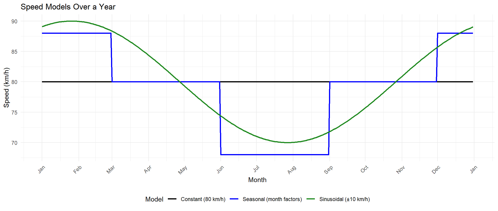

A console-based logistics management system for managing delivery packages, transport vehicles, and delivery routes across major Australian cities.

## 📦 Project Overview

This application is intended for use by logistics employees at a large Australian company entering the freight industry. It supports operations like registering packages, creating and updating delivery routes, assigning trucks, and tracking deliveries.

## 🛠️ Features (to be implemented)

- Create and manage delivery packages
- Create and manage delivery routes
- Assign trucks and packages to routes
- View current package and route states
- Save/load application state
- Search for suitable delivery routes
- Estimate delivery times

## 🗂️ Package Structure

```text
com.company.logistics
├── commands   # Command pattern implementations for each user operation
├── core       # Application engine and StartUp class
├── exceptions # Custom exception classes
├── models     # Domain models: DeliveryPackage, DeliveryRoute, Truck, etc.
└── utils      # Helper classes: input validation, constants, etc.
```

## 🔧 Speed Models

We offer three interchangeable speed‐model implementations behind a common `SpeedService` interface. By default the constant base model is chosen at startup in the `EngineFactory`, but you can swap models **at runtime** using:

```text
CHANGESPEEDMODEL CONSTANT|SEASONAL|SINUSOIDAL
```

| Model         | Description                                                                                                           |
|---------------|-----------------------------------------------------------------------------------------------------------------------|
| **Constant**    | Flat average speed across the year (e.g. 80 km/h).                                                                  |
| **Seasonal**    | Month-based multipliers:<br/>• Dec, Jan, Feb → ×1.10<br/>• Jun, Jul, Aug → ×0.85<br/>• Others → ×1.00                |
| **Sinusoidal**  | Smooth annual variation defined by:<br/><code>v(d) = v_base + A * sin(2π * (d – φ) / 365)</code><br/>Peak on Jan 26. |

where `d` = day of year, `A` = amplitude (e.g. ±10 km/h), and `φ` shifts the peak to January 26. |



> *Figure: Constant (black), Seasonal (blue), and Sinusoidal (green) speed profiles over a 365-day year.*

---

## 💡 Example Console Session

```text
# 1) Create three multi-stop routes (e.g. SYD → MEL → ADL)
CREATEROUTE SYD,MEL,ADL 2025-07-01T08:00
-> Route was created with ID 1.
CREATEROUTE MEL,ADL,BRI 2025-07-02T09:30
-> Route was created with ID 2.
CREATEROUTE BRI,SYD 2025-07-03T07:45
-> Route was created with ID 3.

# 2) List routes (with ETAs)
LISTROUTEINFO
Route 1:
 1. SYD at 2025-07-01T08:00
 2. MEL at 2025-07-01T17:45
 3. ADL at 2025-07-02T01:59

Route 2:
 1. MEL at 2025-07-02T09:30
 2. ADL at 2025-07-02T17:44
 3. BRI at 2025-07-03T17:49

Route 3:
 1. BRI at 2025-07-03T07:45
 2. SYD at 2025-07-03T18:05

# 3) Search for sub-segments
FINDROUTE SYD ADL
Route 1:
 1. SYD at 2025-07-01T08:00
 2. MEL at 2025-07-01T17:45
 3. ADL at 2025-07-02T01:59

FINDROUTE MEL BRI
Route 2:
 1. MEL at 2025-07-02T09:30
 2. ADL at 2025-07-02T17:44
 3. BRI at 2025-07-03T17:49

FINDROUTE ADL SYD
No routes found between ADL and SYD.

# 4) Create packages
CREATEPACKAGE Alice_Smith_0412345678 20 SYD ADL
-> Package was created with ID 4.

CREATEPACKAGE Bob_Jones_0498765432 15 MEL ADL
-> Package was created with ID 5.

CREATEPACKAGE Carol_Lee_0455123456 50 BRI SYD
-> Package was created with ID 6.

# 5) View all packages
LISTPACKAGEINFO
Package 4:
 From SYD → ADL, 20.00kg, Contact: Alice_Smith_0412345678

Package 5:
 From MEL → ADL, 15.00kg, Contact: Bob_Jones_0498765432

Package 6:
 From BRI → SYD, 50.00kg, Contact: Carol_Lee_0455123456

# 6) Assign packages to routes
ASSIGNPACKAGETOROUTE 4 1
-> Package 4 was assigned to route 1.

ASSIGNPACKAGETOROUTE 5 1
-> Package 5 was assigned to route 1.

ASSIGNPACKAGETOROUTE 6 2
-> City SYD not on route

ASSIGNPACKAGETOROUTE 6 3
-> Package 6 was assigned to route 3.

ASSIGNPACKAGETOROUTE 6 1
-> Package is already assigned to route.

# 7) View updated package info
LISTPACKAGEINFO
Package 4:
 From SYD → ADL, 20.00kg, Contact: Alice_Smith_0412345678
 Expected Arrival: 2025-07-02T01:59

Package 5:
 From MEL → ADL, 15.00kg, Contact: Bob_Jones_0498765432
 Expected Arrival: 2025-07-02T01:59

Package 6:
 From BRI → SYD, 50.00kg, Contact: Carol_Lee_0455123456
 Expected Arrival: 2025-07-03T18:05
 
 # 8) View routes with assigned packages
LISTROUTEINFO
Route 1:
 1. SYD at 2025-07-01T08:00
 2. MEL at 2025-07-01T17:45
 3. ADL at 2025-07-02T01:59
 Assigned Package IDs: 4, 5

Route 2:
 1. MEL at 2025-07-02T09:30
 2. ADL at 2025-07-02T17:44
 3. BRI at 2025-07-03T17:49

Route 3:
 1. BRI at 2025-07-03T07:45
 2. SYD at 2025-07-03T18:05
 Assigned Package IDs: 6

# 9) Switch to seasonal speeds
CHANGESPEEDMODEL SEASONAL
-> Speed model switched to SEASONAL

LISTROUTEINFO
Route 1:
 1. SYD at 2025-07-01T08:00
 2. MEL at 2025-07-01T19:28
 3. ADL at 2025-07-02T05:10
 Assigned Package IDs: 4, 5

Route 2:
 1. MEL at 2025-07-02T09:30
 2. ADL at 2025-07-02T19:12
 3. BRI at 2025-07-03T23:32

Route 3:
 1. BRI at 2025-07-03T07:45
 2. SYD at 2025-07-03T19:54
 Assigned Package IDs: 6

LISTPACKAGEINFO
Package 4:
 From SYD → ADL, 20.00kg, Contact: Alice_Smith_0412345678
 Expected Arrival: 2025-07-02T05:10

Package 5:
 From MEL → ADL, 15.00kg, Contact: Bob_Jones_0498765432
 Expected Arrival: 2025-07-02T05:10

Package 6:
 From BRI → SYD, 50.00kg, Contact: Carol_Lee_0455123456
 Expected Arrival: 2025-07-03T19:54
 
# 10) Switch to sinusoidal speeds
CHANGESPEEDMODEL SINUSOIDAL
-> Speed model switched to SINUSOIDAL

LISTROUTEINFO
Route 1:
 1. SYD at 2025-07-01T08:00
 2. MEL at 2025-07-01T18:49
 3. ADL at 2025-07-02T03:59
 Assigned Package IDs: 4, 5

Route 2:
 1. MEL at 2025-07-02T09:30
 2. ADL at 2025-07-02T18:41
 3. BRI at 2025-07-03T21:51

Route 3:
 1. BRI at 2025-07-03T07:45
 2. SYD at 2025-07-03T19:16
 Assigned Package IDs: 6

LISTPACKAGEINFO
Package 4:
 From SYD → ADL, 20.00kg, Contact: Alice_Smith_0412345678
 Expected Arrival: 2025-07-02T03:59

Package 5:
 From MEL → ADL, 15.00kg, Contact: Bob_Jones_0498765432
 Expected Arrival: 2025-07-02T03:59

Package 6:
 From BRI → SYD, 50.00kg, Contact: Carol_Lee_0455123456
 Expected Arrival: 2025-07-03T19:16
 
# 11) Switch back to constant speeds
CHANGESPEEDMODEL CONSTANT
-> Speed model switched to CONSTANT

LISTROUTEINFO
Route 1:
 1. SYD at 2025-07-01T08:00
 2. MEL at 2025-07-01T17:45
 3. ADL at 2025-07-02T01:59
 Assigned Package IDs: 4, 5

Route 2:
 1. MEL at 2025-07-02T09:30
 2. ADL at 2025-07-02T17:44
 3. BRI at 2025-07-03T17:49

Route 3:
 1. BRI at 2025-07-03T07:45
 2. SYD at 2025-07-03T18:05
 Assigned Package IDs: 6

LISTPACKAGEINFO
Package 4:
 From SYD → ADL, 20.00kg, Contact: Alice_Smith_0412345678
 Expected Arrival: 2025-07-02T01:59

Package 5:
 From MEL → ADL, 15.00kg, Contact: Bob_Jones_0498765432
 Expected Arrival: 2025-07-02T01:59

Package 6:
 From BRI → SYD, 50.00kg, Contact: Carol_Lee_0455123456
 Expected Arrival: 2025-07-03T18:05
 
# 12) Invalid speed model
CHANGESPEEDMODEL TURBOBOOST
-> SpeedModelType must be one of CONSTANT, SEASONAL, SINUSOIDAL

# 13) Unknown command
FOOBARCOMMAND
-> Invalid command name: FOOBARCOMMAND

# 14) Invalid route creation
CREATEROUTE SYD,MEL
-> Invalid arguments count. Expected: 2, Given: 1.

# 15) Invalid package creation (missing args)
CREATEPACKAGE Alice 20
-> Invalid arguments count. Expected: 4, Given: 2.

# 16) Invalid package creation (negative weight)
CREATEPACKAGE Dave_Smith_-5 -5 SYD ADL
-> Weight(kg) must be non negative

# 17) Invalid route search
FINDROUTE XXX YYY
-> City must be one of SYD, MEL, ADL, ASP, BRI, DAR, PER

# 18) Reassign already-assigned package
ASSIGNPACKAGETOROUTE 4 1
-> Package is already assigned to route.

# 19) Exit
EXIT
```


## 🧪 Testing

The `tests/` directory is reserved for JUnit 5 tests covering core functionality

## 🚀 How to Run

1. Open the project in IntelliJ IDEA.
2. Run the `StartUp.java` class located in `com.company.logistics` to launch the application.

## 📌 Use Case Highlights

- Register and assign packages to existing routes.
- Bulk assign packages based on location and truck capacity.
- Get delivery estimates based on distances and time.
- Track packages.

## 📂 Save/Load